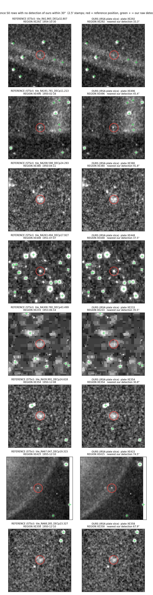
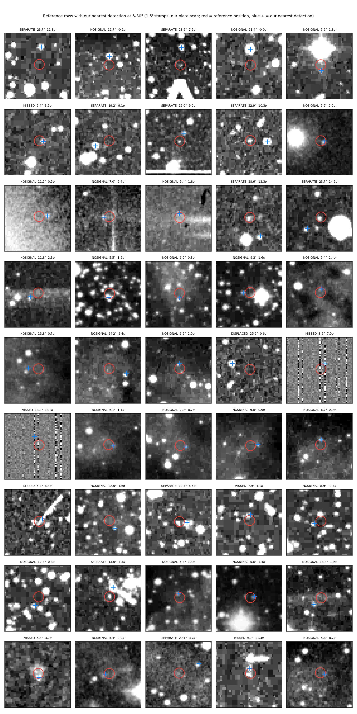

# Archive cutouts vs plate slices — does the image source change the catalogue?

This pipeline gets its pixels by slicing full DSS1 plate scans it downloads from
IRSA, addressed by plate name. The obvious alternative, and the one an earlier
project of ours used, is to request 60′×60′ cutouts from the STScI service,
addressed by sky position. The README's [archive-cutout
ceiling](../README.md#the-archive-cutout-ceiling) section argues the two are not
equivalent, because a position-addressed service picks the plate for you.

This page measures the difference on real catalogues rather than arguing it.

**The short answer**: the two routes agree on **99.57%** of raw detections and
disagree on almost nothing that is real — at most **25 sources in 13,642**, and
a comparable number of the mismatches turn out to be marginal content in the
older catalogue rather than losses here. Candidate-level agreement is lower,
**88.61%**, and that gap is the MNRAS 2022 filter chain behaving differently on
a different pixel realisation, not the image source.

Everything here uses public inputs: two published catalogues, public DSS scans,
and local mirrors of Gaia / PS1 / USNO-B. Tools:
[`tools/archive_slice_parity.py`](../tools/archive_slice_parity.py),
[`tools/nondetection_cutouts.py`](../tools/nondetection_cutouts.py),
[`tools/classify_displaced_misses.py`](../tools/classify_displaced_misses.py).

## What is compared

| | reference — archive route | test — this pipeline |
|---|---|---|
| catalogue | [`jannefi/vasco60` `final_release_v1` `stage_S0.csv`](https://github.com/jannefi/vasco60/blob/main/releases/final_release_v1/run/stage_S0.csv) | [`results/s0-642-20260814`](../results/s0-642-20260814) |
| rows | 15,303 (15,254 after a correct dedup, see below) | 122,820 |
| tiles / plates | 9,566 / 725 | 31,458 / 642 |
| pixels | STScI cutouts, position-addressed | IRSA plate scans, plate-addressed, sliced locally |
| tessellation | corners avoided, 30′ circular cut | full square, no circular cut |
| vetoes | Gaia + PS1 + USNO-B, live CDS/VizieR | Gaia + PS1 + USNO-B, local mirrors |
| WCS-fix | applied | applied |

Both runs apply the Gaia WCS refit, so both land on the same reference frame —
which is why the agreement below is as tight as it is.

**The comparison is one-way by design.** The reference set is spatially narrower
inside each tile (30′ circular cut) but wider on sky (725 plates), so the two are
neither nested nor co-extensive. Recall in the reference → ours direction is the
only well-posed statement. The reverse ratio is a candidate-count difference, a
separate question, and is not reported here as parity.

## Scoping: the footprints are identical above dec 0

Our 642 plates are a strict subset of the reference run's 725, so scoping is a
plate-set question with no ambiguity. Membership uses a 0.75° radius around tile
centres taken from `tile_manifest.csv` — never from the tile ids appearing in
the stage CSV, which would silently drop every tile that produced no survivor.

| dec band | reference rows | inside our footprint | covered |
|---|---:|---:|---:|
| (−30, −20] | 84 | 0 | 0.0% |
| (−20, −10] | 303 | 0 | 0.0% |
| (−10, −4] | 1,208 | 0 | 0.0% |
| (−4, 0] | 826 | 760 | 92.0% |
| (0, 10] | 1,885 | 1,885 | **100.0%** |
| (10, 30] | 4,236 | 4,236 | **100.0%** |
| (30, 60] | 4,463 | 4,463 | **100.0%** |
| (60, 90] | 2,298 | 2,298 | **100.0%** |

**All 1,661 excluded rows sit on plates outside our 642 — there are no geometric
edge cases.** The reference run's tessellation reaches dec −29.5 while this one
stops at −4.1; its dec ≥ 0 cut is a final post-process stage applied to 495
survivors, not a scope on the tessellation, so its S0 legitimately spans −29.9
to +87.1. Footprint-scoped population: **13,642**.

An integrity check falls out of this: every reference row sits within **0.4965°**
of its own tile centre, confirming the 30′ circular cut was applied and that the
catalogue carries no sign-flip or bad-WCS rows.

## Candidate parity: 88.61%

Recall (%) of reference rows having an S0 row of ours within the match radius:

| scope | n | 1″ | 3″ | 5″ | 10″ | 30″ |
|---|---:|---:|---:|---:|---:|---:|
| all | 15,303 | 78.96 | 78.99 | 78.99 | 79.00 | 79.04 |
| footprint-scoped | 13,642 | 88.58 | 88.61 | **88.61** | 88.62 | 88.66 |

Two features matter more than the number.

**The curve is flat** — 1″ to 30″ moves recall by 0.08 points. There is no
displaced population; a row either matches essentially exactly or is absent.

**Matches are exact**: median separation **0.017″**, 90th percentile 0.044″,
99th 0.110″. Two independently produced catalogues, from different pixel sources
through different tessellations, placing the same source to a fiftieth of an
arcsecond.

## Raw detection parity: 99.57% — the number that answers the question

Matching the same rows against our raw SExtractor detections rather than our
final candidates separates "we never saw it" from "we saw it and the chain
removed it".

Raw recall, footprint-scoped: 98.08% @1″, 99.51% @3″, **99.57% @5″**, 99.93% @30″.

| | rows | share |
|---|---:|---:|
| reproduced in our S0 | 12,088 | **88.61%** |
| detected, removed by our chain | 1,501 | 11.00% |
| unmatched at 5″ | 58 | 0.43% |

**Swapping position-addressed archive cutouts for plate-addressed slices costs
essentially nothing at the detection stage.** This pipeline tiles far more
densely — 49 tiles per plate against 13 — so every position is processed on
every plate covering it, and that union removes the plate-selection dependence
the README describes.

## The 58 unmatched rows, fully accounted for

Statistics cannot say whether an unmatched row is a source we missed, a source
on pixels we never saw, or a marginal entry in the older catalogue. Pixels can.

| category | n | of 13,642 |
|---|---:|---:|
| in the 0.5–0.75° corner ring — no tile of ours has pixels there | 5 | 0.037% |
| **no source at the reference position in *either* run's pixels** | **27** | **0.198%** |
| two distinct objects — our nearest detection is an unrelated neighbour | 10 | 0.073% |
| real source present in our pixels that we did not extract | 7 | 0.051% |
| footprint-edge plate disagreement | 1 | 0.007% |
| genuine non-detection — the faintest rows in the reference catalogue | 8 | 0.059% |

**At most 25 real sources were not reproduced (≤0.183%), against 27 reference
rows with no source at the catalogued position (0.198%).** Roughly half the
residual is reference-side.

### The 8 genuine non-detections



Reference tile on the left, our plate scan on the right, 2.5′ stamps; red circle
is the reference position, green crosses are our raw detections.

`REGION` **and** `PLTLABEL` agree **8/8** — the archive served the identical
physical plate we sliced, confirmed from FITS headers rather than plan labels,
so plate selection is excluded. Peak significance at each position, measured as
(peak − annulus median) / annulus MAD-σ, **correlates 1.000** between the two
pixel sources (medians 5.4σ and 5.3σ). All 8 exceed 3σ in both.

So there is real signal at every one of these positions and our extraction
simply did not produce a detection. The reason is that they are the faintest
rows in the reference catalogue. Their own measured `SNR_WIN`, against that
run's gate of **> 30**: 30.70, 30.82, 30.89, 31.47, 35.65, 37.77, 38.88, 51.26 —
four clear the gate by less than 1.5. The ordering across outcomes is monotone:

| outcome | median `SNR_WIN` |
|---|---:|
| reproduced in our S0 | 56.3 |
| removed by our chain | 46.4 |
| never detected by us | 33.6 |

These 8 are the extreme tail of the same threshold sensitivity that produces the
11% gap — far enough down that they fail at detection rather than at a gate.

### The 45 rows whose nearest detection sits at 5–30″



1.5′ stamps of our plate scan; red circle is the reference position, blue cross
our nearest detection.

Two tests per row: is there signal at the reference position in our pixels, and
does the reference run have its own separate detection where our nearest
detection sits?

| class | n | meaning | median peak σ | median sep |
|---|---:|---|---:|---:|
| **no signal** | **27** | nothing above 3σ at the position, either run | 1.35 | 7.5″ |
| separate | 10 | two distinct objects; ours is a neighbour | 9.07 | 23.3″ |
| missed | 7 | signal in our pixels, not extracted | 7.05 | 6.7″ |
| displaced | 1 | footprint edge, see below | 0.56 | 25.2″ |

**The estimator is validated in-band.** On 150 reference rows we *did* reproduce
it returns median **24.9σ with 100% above 3σ**; on these 45 it returns **2.0σ
with 37.8%**. The difference is in the data, not the method. Pixel agreement
between the two sources is **0.9977** across 44 of the 45.

The single displaced row is a footprint-edge case at dec +1.36 where the
reference used plate XE574 and our tiling covers that position only via
XE634/XE635 — the one row in 45 where the two pixel sources genuinely differ.

**A caveat the figure makes visible and no table would.** The σ test asks
whether there is flux, not whether it is astrophysical. Several panels show
unmistakable plate defects — heavy vertical striping in two, a bright diagonal
scratch or trail in a third — and all of them score as "signal present". So 25
is an upper bound on real sources missed, and the true count is lower.

**This is not a criticism of the reference catalogue.** S0 is the raw candidate
stage; that run then applied its own post-process chain (morphology, shape, GSC,
SkyBoT, SuperCOSMOS, PTF, VSX, declination scope) and finished at 440 rows.
Marginal content at S0 is precisely what those later stages exist to remove.

## What removes the other 11%

The 1,501 rows we detect but drop are not removed by the veto chain. A
null-controlled crossmatch against local mirrors — with PS1 carrying the
production `nDetections >= 3` cut, without which a 5″ PS1 match is near
saturated — shows the rows we *keep* give textbook veto step functions (0 of
12,088 inside 5″ in all three catalogues) while the rows we *drop* are also
strongly depleted inside 5″. They are not catalogue stars.

Where a run retained its full per-tile chain, the verdict can be read from the
per-row `reject_reason` rather than inferred. Pooling two such tile sets — 592
reference rows traced, 64 removed:

| stage | share of removals | 95% CI |
|---|---:|---|
| MNRAS filters | **85.9%** | [75.4, 92.4] |
| veto chain | 9.4% | [4.4, 19.0] |
| spike mask | 4.7% | [1.6, 12.9] |

Both tile sets independently reproduce the headline survival rate — 89.23% and
89.16% against 88.61% — and agree on the filter share to 0.4 points.

**This agrees with the independent measurement in
[`FUNNEL_ATTRIBUTION.md`](FUNNEL_ATTRIBUTION.md)**, which uses the public SVO
`vanish-possi` catalogue instead and finds veto 17.0% / filters 83.0%. Two
unrelated reference catalogues, two disjoint tile samples, the same conclusion:
**the MNRAS 2022 quality gates, not the catalogue vetoes, dominate the loss.**

**Sample-size discipline**: 64 removed rows. These intervals are wide and no
share here should be quoted as a precise figure. The ordering is what the sample
supports.

### Why: the rows we drop are the rows that barely passed

The reference run's own measurements are available for the exact rows in
question. Split by *our* chain's outcome (12,083 kept, 1,501 removed):

| quantile | 10% | 25% | 50% | 75% |
|---|---:|---:|---:|---:|
| `SNR_WIN` (gate > 30) kept | 34.57 | 42.17 | 56.26 | 79.17 |
| `SNR_WIN` removed | **31.07** | 35.50 | 46.39 | 65.53 |
| `SPREAD_MODEL` (gate > −0.002) kept | −0.0009 | 0.0005 | 0.0037 | 0.0090 |
| `SPREAD_MODEL` removed | **−0.0018** | −0.0013 | 0.0021 | 0.0095 |

Within 20% of a gate: `SNR_WIN` 26.7% of removed rows against 12.8% of kept
(2.08×); `ELONGATION` 31.5% against 19.4% (1.62×). On a minimum normalised
margin to the nearest gate, removed rows sit 3.4× closer at the 10th percentile;
Mann-Whitney p = 2.4e-85 over all 13,584 rows.

**Every gate says the same thing: the rows this pipeline drops are the rows that
barely passed the other one.** These are sources on a threshold, and a different
pixel realisation — different cutout, different PSFEx model, different tile
population — flips them.

So **88.61% is a measurement of how reproducible the MNRAS 2022 filter chain is
across pixel realisations**, not of image sourcing. Anyone attempting to
reproduce a POSS-I transient search should expect a candidate list that agrees
with a previous one at roughly this level even when the underlying detections
agree at 99.6%.

## Two known defects in the reference run, and what they cost

The reference release predates two fixes made in that repository
([#7](https://github.com/jannefi/vasco60/pull/7),
[#8](https://github.com/jannefi/vasco60/pull/8)). Both were checked against this
comparison rather than assumed harmless.

**The deduplication defect is present and costs 0.32%.** That run deduplicated
within an assumed plate label (`plate_id + angular_sep <= 0.250"`) and dropped 19
rows. Running a global dedup over the published catalogue finds **49 duplicate
pairs, every one of them cross-plate and none same-plate** — so the partitioned
rule missed all of them. That is 98 rows, 0.32%; the catalogue is properly
**15,254** rows rather than 15,303.

All 98 fall inside our footprint, 90 matched and 8 unmatched, so collapsing them
moves candidate recall from **88.61% to 88.60%**. Nothing else in this page
changes.

Worth recording *why* the same defect cost roughly 10% in this pipeline's own
history and only 0.32% here: **it scales with tile overlap.** The reference run
avoided plate corners and applied a 30′ circular cut, so neighbouring tiles
barely overlap and few sources are seen twice. This pipeline lays 49 full square
tiles on each plate, deliberately overlapping, which is exactly the condition
that produces cross-plate duplicates. Same bug, two orders of magnitude apart in
effect, because the tessellations differ.

**The silent-empty-tile defect did not bite this release.** Its manifest flags
2,908 of 9,566 tiles (30.4%) as `missing survivors csv`, which reads like the
failure mode — a failed extraction recorded as a successful empty tile. It is
not. Sampling those tiles on disk: all carry the complete per-stage chain
(`pass2`, `wcsfix`, all three `after_*_veto`, `filtered`), their `pass2.csv`
holds a **median 4,416 raw detections** — *denser* than tiles that did produce
survivors (2,332) — and every sampled `filtered.csv` has zero data rows. So
extraction succeeded and there was genuinely nothing to survive. The 31.5%
zero-survivor rate against this pipeline's 17.1% simply reflects a sparser run:
2.3 survivors per productive tile against 5.0 here.

## Limitations

1. **Veto implementations differ** — the reference queried CDS/VizieR live,
   this pipeline reads local mirrors. The veto share above is measured against
   our mirrors.
2. **The stage split rests on 64 removed rows.** Two independent samples agree
   on the ordering, but every share carries a roughly ±10-point interval.
3. **The reference run is not an independent pipeline** — it is an earlier route
   of the same project, sharing filter thresholds and the WCS-fix. This measures
   route-to-route reproducibility, not agreement with a third party. For a
   genuinely external comparison see
   [`FUNNEL_ATTRIBUTION.md`](FUNNEL_ATTRIBUTION.md), which uses SVO
   `vanish-possi`.
4. DSS scans carry no photometric calibration; magnitudes are instrumental and
   are only ever compared within one pipeline.
5. Peak significance measures flux, not astrophysical origin — see the plate
   defects noted above.

## Reproducing

The reference catalogue and its per-tile chain are public in
[`jannefi/vasco60`](https://github.com/jannefi/vasco60); this pipeline's
released catalogue is in [`results/`](../results). The raw detection arm needs
the per-plate detection CSVs this project retains alongside a run.

```
python3 tools/archive_slice_parity.py \
    --ref-s0 <vasco60>/releases/final_release_v1/run/stage_S0.csv \
    --ref-manifest <vasco60>/releases/final_release_v1/run/tile_manifest.csv \
    --our-s0 results/s0-642-20260814/stage_S0.csv.gz \
    --our-manifest results/s0-642-20260814/tile_manifest.csv.gz \
    --radec-dir <run>/radec \
    --out-dir work/archive_slice_parity
```

The tool runs its own self-tests and aborts on failure: reference rows below our
declination floor must score out-of-footprint, per-plate counts must sum to the
scoped total, and raw-arm distances must not exceed candidate-arm distances by
more than the WCS-fix offset.

One trap worth repeating for anyone reading the reference run's tiles:
`sextractor_pass2.csv` is **~65 MB per tile** because of the `VIGNET` column, so
always pass `usecols`. `sextractor_pass2.filtered.csv` is 23 KB and holds
survivors only. `RA_corr`/`Dec_corr` are written by the wcsfix stage and live in
`sextractor_pass2.wcsfix.csv`, not in `sextractor_pass2.csv`.
