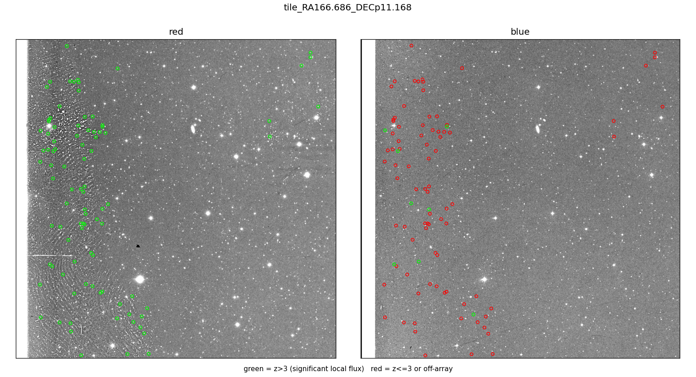
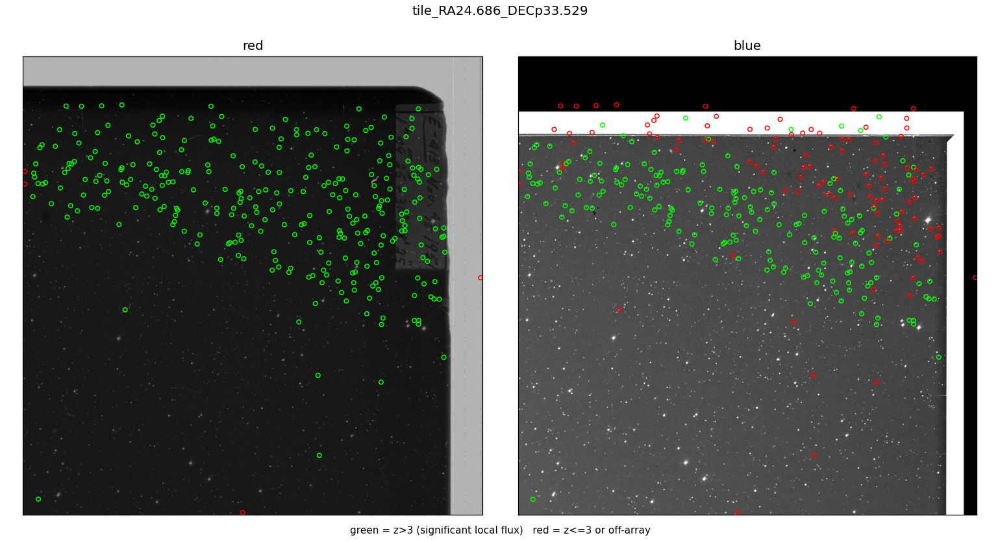
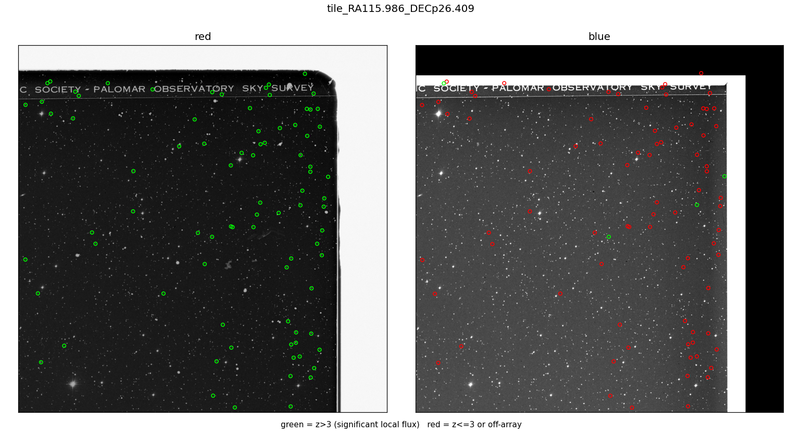
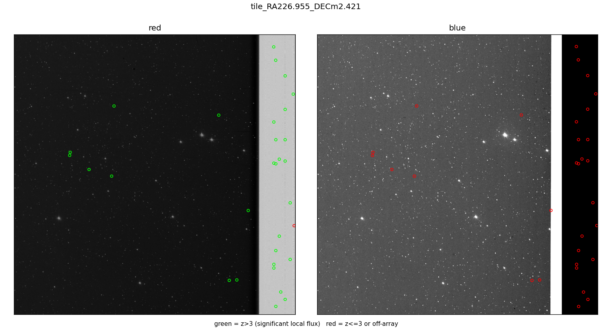
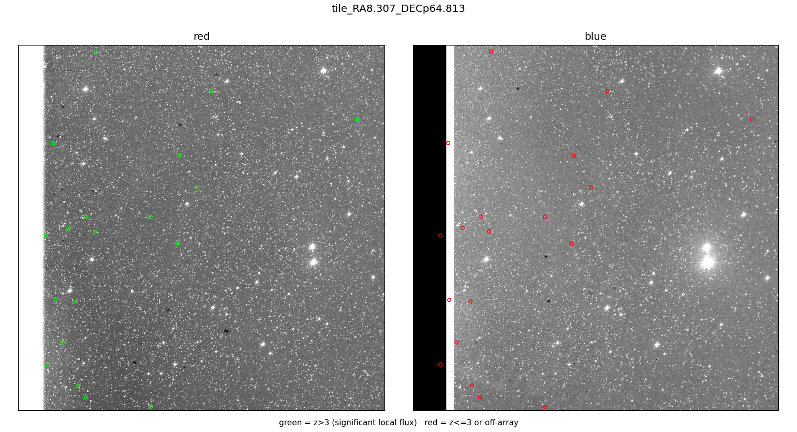

# Do hot-tile survivors show up on an independent exposure?

A small number of tiles (244 of 642 plates, at a ≥20-survivors/tile threshold) carry a disproportionate
share of catalogue survivors — the "hot tile" concentration. Four
explanations have been checked and ruled out for these tiles: un-vetoed Gaia
stars, astrometrically displaced catalogued stars, scan artifacts (they
survive an independent SuperCOSMOS digitization of the same plates), and
USNO-B-catalogued sources. One explanation was left standing without direct
evidence: a plate-emulsion or scan defect specific to the red (E) glass.
SuperCOSMOS can't test that hypothesis — it re-scans the *same* physical
glass, so a defect in the emulsion itself would survive that check too.

The POSS-I O (blue) plate is a genuinely independent exposure: different
glass, same approximate epoch. A real astronomical source should generally
show at least some flux there; a defect specific to the red emulsion should
not. This applies to both `results/s0-642-20260814/` and
`results/s0-642-paper-parity-20260828/` — the tiles checked here are drawn
from the primary release's own hot-tile ranking, and the mechanism being
tested is a property of the plate material, not of either build's veto
configuration.

## Method

`tools/blue_plate_hot_tile_check.py`. For each tile: fetch one 60′ STScI
`dss1-red` and one 60′ `dss1-blue` cutout at the tile centre
(`vasco.downloader.fetch_skyview_dss`). Local-background z-score per
position — a small aperture for the peak, a surrounding annulus for a
median/MAD background estimate, off-array positions excluded. Per image,
**polarity is resolved against the 40 brightest Gaia stars in the footprint**
rather than assumed. Every catalogue survivor in the tile, and a matched
population of random on-array null positions, gets a z-score on both bands.
Red is the positive control — survivors are red-plate detections by
construction, so they must show real flux there; blue is the actual
question. Gaia is used only to fix which pixel-value sign means "star" in
each image, never as a match or veto criterion.

**Positive-control cross-check, checked before trusting anything else**: the
40 bright Gaia stars used for polarity resolution show robust, strong blue
detection in every tile checked (median z 9.86–25.67, all resolved) —
roughly 40–45% of their own red-band strength, but nowhere near the null
floor. This rules out registration error, aperture mis-sizing, or "the blue
plate is just too shallow to matter" as explanations for what follows: real
stars are easily detected by this method on these exact images.

## Sample and results

Two passes. First, 6 tiles hand-picked for diversity (top tile per plate,
one per distinct plate, from the released catalogue's top hot tiles):
**XE296** (291 survivors), **XE074** (186), **XE407** (97), **XE491** (91),
**XE049** (85), **XE366** (83). Hand-picking meant the ratio it produced
couldn't be trusted as a population estimate on its own, so a second pass
drew 30 tiles genuinely at random (fixed seed, from the same 671-tile /
244-plate pool defined by the `rows_emitted_to_S0 ≥ 20` threshold above),
excluding the 6 already checked.

**Pilot (6 tiles)**: one tile (XE296) is a clear blue-positive exception —
63.5% of survivors show blue flux above a 12.7% null rate, and both bands
independently show a genuinely dense star field there. One tile (XE407) is
inconclusive — even the red positive control is weak. The remaining 4 tiles
combined: survivors show blue flux at **9.0%** (z>3) against a **16.0%**
null rate — less than what random field positions show, the opposite of
what an ordinary star population should do.

**Random 30-tile draw**: 9 of 30 tiles (30%) fail the red positive control
and are excluded — a real finding on its own, since the hand-picked pilot's
lower inconclusive rate (1 of 6) had understated how often even the red
signal is marginal once tiles aren't cherry-picked toward clear cases. Of
the 21 valid tiles: **17 (81%) show survivors below their own tile's null
blue-detection rate**, only 4 show an excess — a two-sided sign test on that
split gives **p = 0.0072**. Combined: blue survivors 9.04% (z>3) against a
14.90% null — reproducing the pilot's ratio almost exactly, now backed by an
unbiased sample and a real significance test rather than 6 hand-picked
tiles.

## Visual examples

**XE491** — the cleanest case. The red image shows an obvious rippled
interference pattern running through part of the tile, clearly not a
stellar structure. Nearly every survivor sits inside that band. The blue
image shows an ordinary field in the same region, and almost none of those
positions show blue flux.

**XE296** — the exception. Red shows a printed plate-label/stamp region and
what looks like a genuinely denser field; blue independently confirms a
dense, ordinary field in the same area, and most survivors show real blue
flux. This tile's hot-tile status looks like sky density, not a defect.

**XE366** — a printed plate-title-text band runs across the tile. Survivors
sit on what look like real point sources in red; almost none show blue flux
at the same positions.

**XE622** — most survivors sit in the main field on plausible real sources,
but several sit in a distinct bright vertical strip at the tile's edge (a
scan/mosaic-seam region), all showing zero blue flux.

**XE050** — a very dense field. Survivors sit on plausible stars in red;
zero show blue flux, despite blue showing an equally dense field nearby.
Flagged below as the source of a real, unresolved caveat.

## Conclusion

The plate-emulsion/scan-defect hypothesis is no longer just the one
explanation left standing by elimination — it now has direct, independent,
statistically significant supporting evidence. On a genuine random sample,
81% of tiles with a usable positive control show fewer independent-exposure
counterparts than chance, at p = 0.0072. Hot-tile status does not have one
single cause even within this sample: one tile in six behaves like an
ordinary dense star field, not a defect.

## Caveats

- **Sample scale**: 36 tiles checked against 244 affected plates
  survey-wide. The direction and rough magnitude are now backed by a real
  significance test, but the exact ratio should not be over-generalised
  without a larger draw.
- POSS-I O is intrinsically shallower than POSS-I E — every comparison here
  is survivor-vs-null on the *same* image, never an absolute blue-z
  threshold read on its own.
- The null itself tracks field density (its own z>3 rate varies roughly
  10–44% across tiles), which is why survivors are always compared against
  their own tile's null rather than a fixed threshold.
- **An unresolved confound**: in a sufficiently crowded field, the
  local-background noise estimate itself rises, which can suppress
  z-scores for genuine sources too (XE050 above). This isn't yet separated
  from the emulsion-defect signal — a de-blended or PSF-fit measurement
  would be needed to fully disentangle the two in dense tiles. Both
  readings point the same direction (survivors under-represented on the
  independent exposure); they differ on how much of that is defect versus
  method sensitivity.

## Files

- `tools/blue_plate_hot_tile_check.py` — the check.
- `vasco/downloader.py` — `fetch_skyview_dss`'s `dss1-blue` support (a real
  bug was found and fixed while building this: the STScI request parameter
  that selects plate colour was hardcoded to red regardless of which colour
  was requested; unexercised by any prior caller, so no earlier finding was
  affected).
