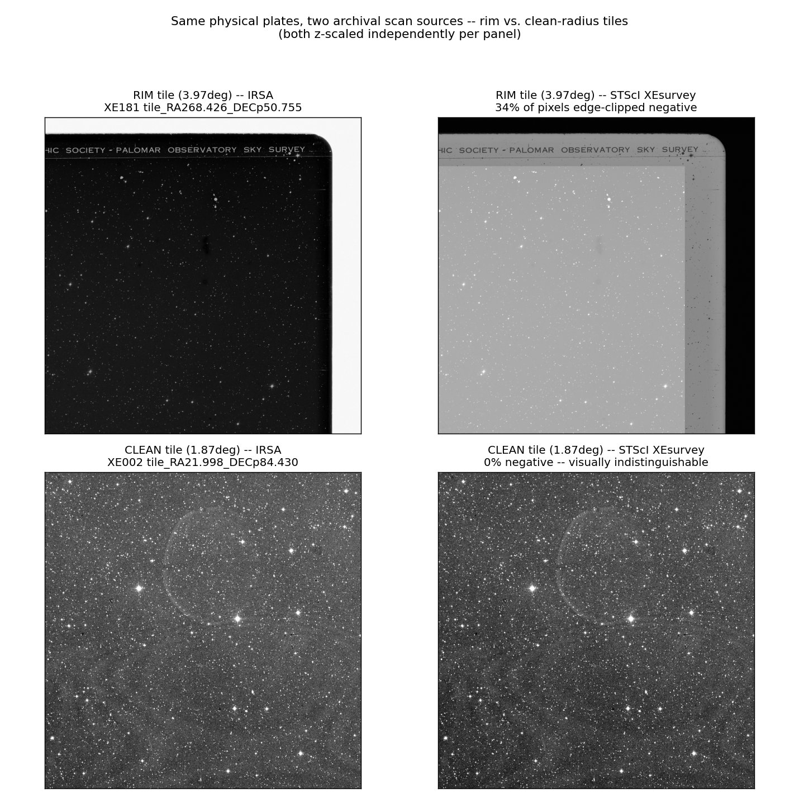
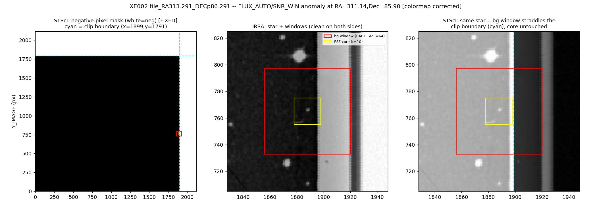
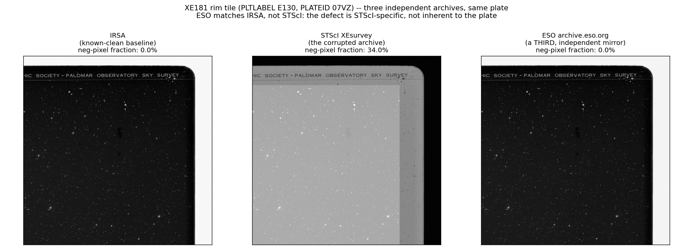

# Two archives of the same plates — does the scan source change the catalogue?

DSS1 plate scans are available from more than one archive. This pipeline
pulls full-plate FITS from IRSA, addressed by plate name (see
[the archive-cutout ceiling](../README.md#the-archive-cutout-ceiling)). A
second public archive — STScI's own `FitsArchive/XEsurvey` folder — hosts
scans of the same physical plates, packaged independently. Both are public,
both trace to the same photographic originals, and a third party reproducing
this project's method might reasonably pull from either.

This page measures whether that choice matters.

**The short answer**: it depends entirely on where in the plate a tile sits.
Near a plate's centre, the two archives are indistinguishable — same stars,
same background, same final candidate list. Near a plate's physical edge,
the STScI copy carries a **real, structural pixel defect** in a band close
to the array boundary — not decompression noise, not a rounding artefact — a
sharp region where its pixel values run strongly negative where IRSA's run
strongly positive. On the 6 tiles checked here (2 plates, both radial
zones, full pipeline including the veto and MNRAS filter chain), that
defect was present on **3 of 3 rim tiles checked** and **absent on 2 of 2
centre tiles**, with no exceptions. Its effect on the final candidate list
per tile ranges from none to a 46% count difference, depending on whether
any given tile's real sources happen to sit near the defective region.

**This project is not affected** — every result in this repository uses one
consistently-sourced set of IRSA scans throughout. This page exists for
anyone comparing catalogues built from different scan sources, or
attempting an independent reproduction that pulls plates from STScI
instead.

Everything here uses public inputs and the pipeline's own unmodified code —
`tools/slice_plate_tiles.py`, `vasco/cli_pipeline.py` `step2`–`step4`, run
directly against both archives' pixels with identical parameters (the
`paper-parity` branch's veto/spike-mask configuration, WCSFIX on). No code
was changed to produce anything below.

## What is compared

| | IRSA | STScI XEsurvey |
|---|---|---|
| source | `irsa.ipac.caltech.edu/data/DSS/images/dss1red` | `archive.stsci.edu/missions/dss/FitsArchive/XEsurvey` |
| addressing | plate name | plate name |
| GSSS astrometric keywords | byte-identical between the two archives | byte-identical |
| WCS agreement (whole-plate) | — | 0.00000″ at 5 sample points |
| provenance match to IRSA plate IDs | — | 926/932 (99.4%) |
| pipeline / parameters | identical both sides — same `.sex` configs (byte-diffed), same veto set (Gaia+PS1), same spike catalogue (USNO-B), same WCSFIX correction, same per-plate epoch | |

Astrometric identity was established first and is solid: same plates, same
solved geometry. What follows is about the *pixel values themselves*, not
the coordinate system.

## The mechanism: a hard-edged clip near each plate's physical boundary

Traced one anomalous candidate — bright, real, `FLAGS=0` on the IRSA side —
that survives on IRSA and is dropped on STScI with a corrupted measurement
(flux 4.1x too high, signal-to-noise flipped negative). The star's own
point-spread core is pixel-identical between archives; the corruption comes
entirely from the *background estimation window* SExtractor uses around it,
which straddles a sharp rectangular region where STScI's pixel values
invert sign. Mapped through the tile's WCS into the full plate's own pixel
frame, that region sits only **~6–9 arcmin from the plate array's own
edge** — a thin clipped border, not a smooth gradient across the plate.



*Top row*: a tile ~4° from its plate's centre (near the physical edge).
The two archives are visibly different at a glance — STScI's whole
background tone is shifted, and the bright vignette strip that reads white
in IRSA reads dark in STScI. *Bottom row*: a tile ~1.9° from centre. The
two panels are visually indistinguishable, down to a faint ring-shaped
plate defect present identically in both (a real, shared feature of the
photographic plate, not an artefact of either archive).



## Results across 6 tiles, 2 plates, both zones

Full pipeline run both ways per tile (Gaia+PS1 veto, USNO-B spike mask,
WCSFIX on, MNRAS filter chain) — not just raw detection counts:

| tile | plate | distance from plate centre | IRSA survivors | STScI survivors | matched (≤2″) | STScI negative-pixel fraction |
|---|---|---:|---:|---:|---:|---:|
| `RA313.291_DECp86.291` | XE002 | 3.97° | 24 | 21 | 75% | 24.2% |
| `RA15.438_DECp81.733` | XE002 | 3.37° | 10 | 10 | **100%** | 16.5% |
| `RA21.998_DECp84.430` | XE002 | 1.87° | 11 | 11 | 90.9% | **0.0%** |
| `RA268.426_DECp50.755` | XE181 | 3.97° | 22 | 14 | 54.5% | 34.0% |
| `RA272.877_DECp48.983` | XE181 | 1.87° | 7 | 4 | 57.1% | **0.0%** |

**The pixel defect itself is deterministic**: every rim tile (>2.8° from
plate centre) shows it, every centre tile (<2.1°) does not — confirmed on
two plates. **Its effect on the final candidate list is not** — one rim
tile with 16.5% corrupted pixels still matched 100%, because none of its
real sources happened to sit near the defective region; another matched
only 54.5%. It depends on where individual sources fall, not just on
whether the defect is present in the tile.

The two centre-tile match rates (90.9%, 57.1%) look large in percentage
terms but come from only 4–11 survivors per tile — ordinary near-threshold
photometric jitter between two independently-processed pixel copies (both
archives round-trip the same photographic original through different
digitisation/compression pipelines), not the structural defect above:
directly confirmed by checking pixel data at both centre tiles — **0.0%
negative pixels, no exceptions**.

## Does the defect manufacture candidates that shouldn't pass?

A natural follow-up: could the corrupted background inflate a source's
measured significance enough to push it *over* the survey's SNR gate when
it would otherwise fail? The mechanism can clearly move flux/SNR
substantially — up to a full sign flip in the case above, a ~40% inflation
on a second, independently-checked real star. Tracing every candidate that
passed on STScI without an IRSA counterpart (across all 6 tiles, matched
against IRSA's raw catalogue at a wide radius, not just the tight tolerance
used for the headline numbers) found the mechanism doing exactly this kind
of inflation on one more real star — but in every case checked, the
inflated source was already above the gate on the clean side too, just by
a smaller margin. One genuine gate-flip (fail on IRSA, pass on STScI) was
found, but its background window was independently confirmed to be
completely uncorrupted — ordinary cross-archive photometric noise, not
this mechanism. **Mechanistically capable of manufacturing a false pass;
not caught doing so in the tiles checked so far.**

## A third, independent archive: same answer

If the defect were a property of the plate itself — something any faithful
digitization would reproduce — a third archive should show it too. Fetched
the same sky position from **ESO's own DSS mirror**
(`archive.eso.org/dss/dss/image`), a fully independent archive.



Confirmed same plate first, then compared: **ESO shows 0.0% negative
pixels — matching IRSA, not STScI.** Two independent archives agree with
each other and disagree with STScI specifically, on the one plate where a
clean three-way comparison was possible.

A second attempt, on the other plate checked in this note, ran directly
into the archive-cutout ceiling described earlier in this README: querying
ESO's position-addressed service at that tile's exact coordinates returned
a **different plate entirely** than the one IRSA and STScI both serve for
that position — an unplanned, live example of exactly that problem, not a
hypothetical one.

## Caveats

- **6 tiles, 2 plates.** Both POSS-I red, both near/mid-northern
  declination (XE002 near-polar, XE181 +48°). No claim about the exact
  distribution of impact across a full survey, and no check yet at low
  declination or on a different plate generation.
- **Centre-tile match percentages are noisy at these small sample sizes**
  (4–11 rows) — the qualitative finding (no pixel defect, smaller absolute
  impact than rim tiles) is solid; the specific percentages are not
  precise estimates of a survey-wide rate.
- **The exact margin from the plate edge (~6–9′) and the transition's
  sharpness were characterised on one tile in detail** and corroborated on
  five more via presence/absence of the pixel signature; not yet mapped
  at sub-tile resolution on every plate edge.
- **What causes the STScI-side pixel inversion at the edge is not
  identified** — only that it is present, structural, and archive-specific
  (both archives' GSSS astrometric keywords are byte-identical, so this is
  a pixel-processing difference, not a geometry difference).
- **The candidate-manufacturing question is checked, not settled**: no
  confirmed case of the defect flipping a genuine fail to a pass, only
  that it moves measured SNR by enough (40-100%+) that it plausibly could.
- **The third-archive cross-check is one plate.** The second attempt hit a
  different-plate mismatch from ESO's own service before a same-plate
  comparison was possible.

## Reproducing

```
tools/slice_plate_tiles.py --plate-fits <plate>.fits --tiles-dir <out> \
    --crpix-table data/plate_crpix_table.csv
python -m vasco.cli_pipeline step2-pass1 --workdir <tile>
python -m vasco.cli_pipeline step3-psf-and-pass2 --workdir <tile>
VASCO_DISABLE_USNOB=1 VASCO_SPIKE_CATALOG=usnob VASCO_PLATE_EPOCH_YEAR=<epoch> \
    python -m vasco.cli_pipeline step4-xmatch --workdir <tile>
```

Same entry points as any normal run — nothing here required pipeline
changes. STScI XEsurvey plates: `https://archive.stsci.edu/missions/dss/FitsArchive/XEsurvey/`.
